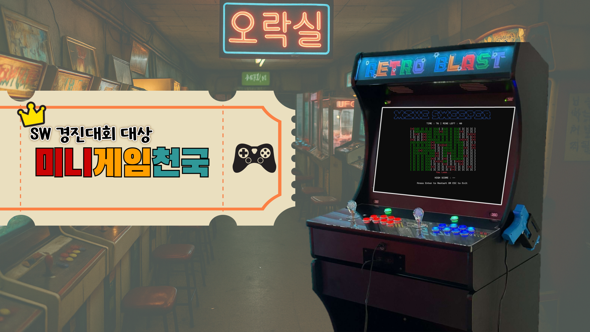
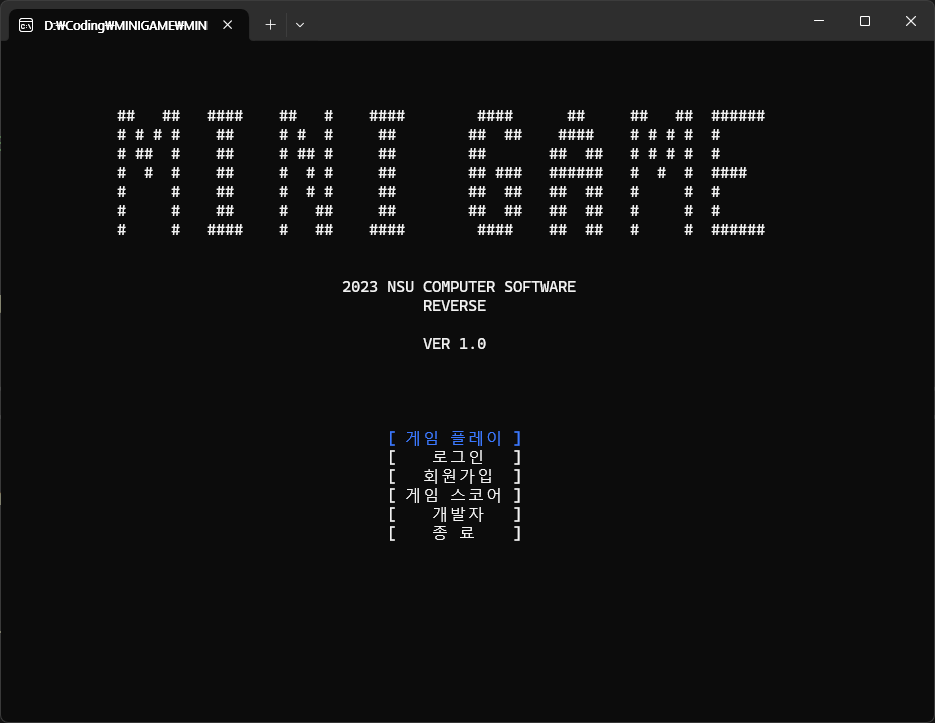
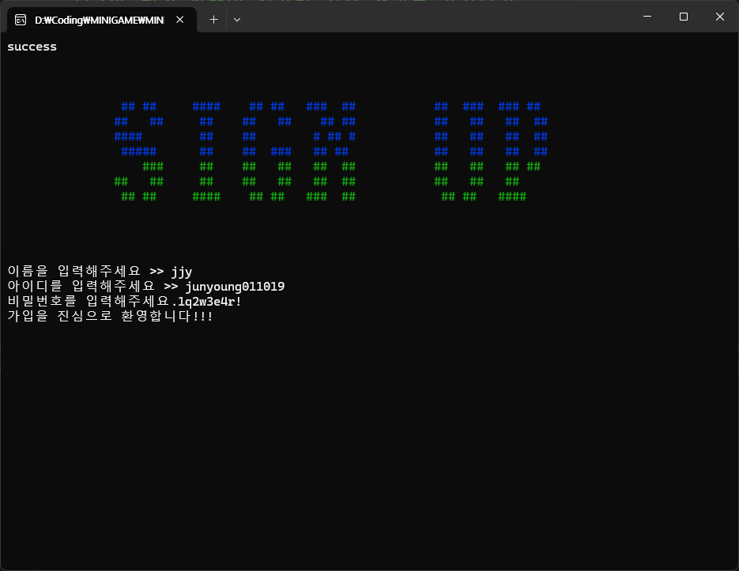
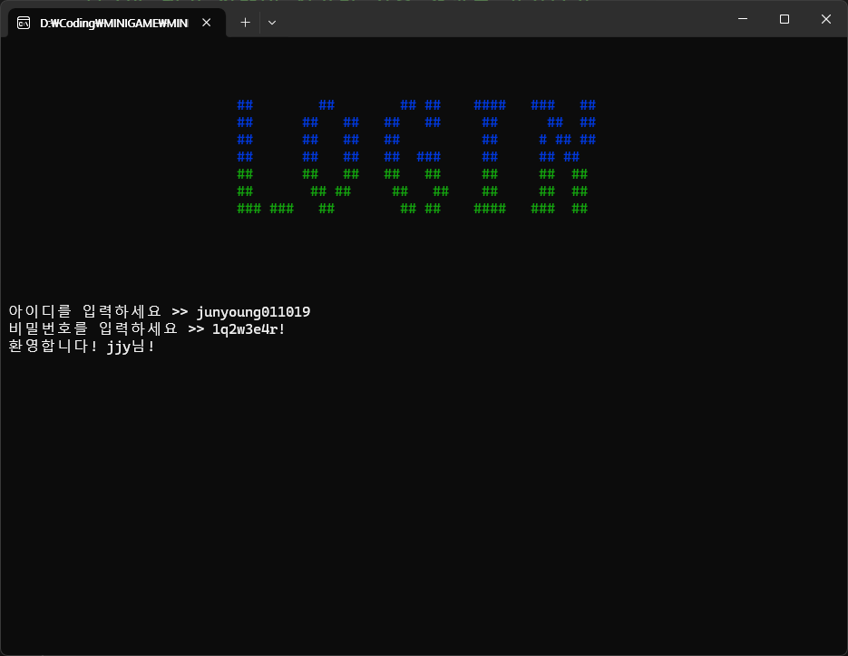
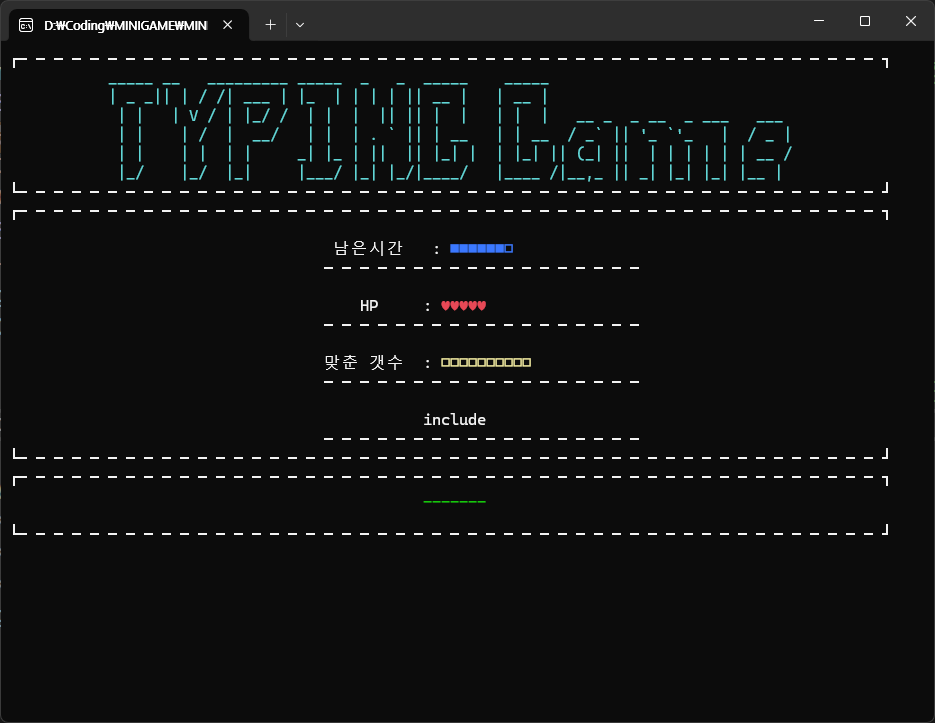
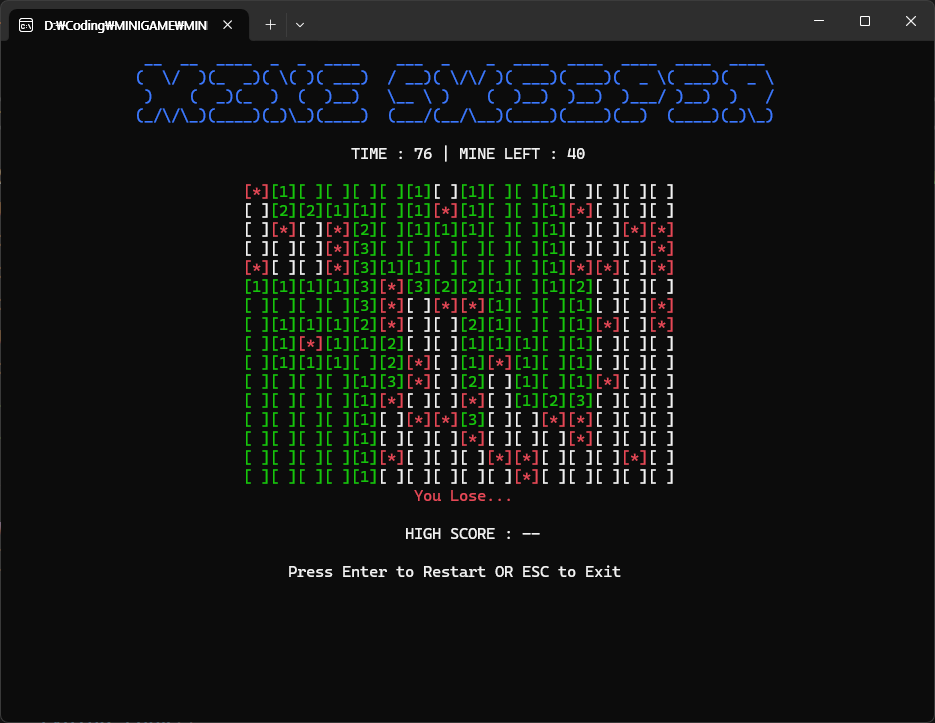
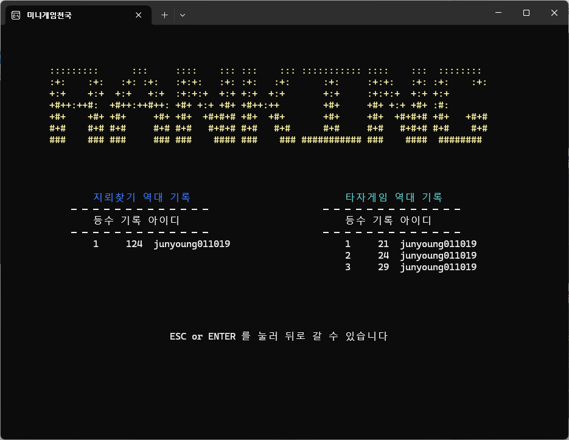
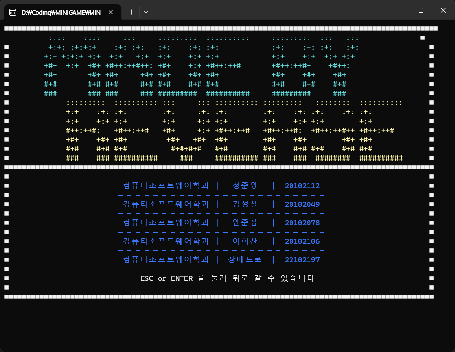

# [SW경진대회 대상] 미니게임천국



> ### [📌 유튜브 시연 영상 보기](https://youtu.be/ZMaegZ8kPBg?si=-OLllSi7j72tb1pg) 

<br>

## 🌟 프로젝트 소개

- 미니게임천국은 C++로 개발된 지뢰찾기, 타자게임을 플레이할 수 있는 시스템입니다.
- 또한 타자게임의 경우 개발에 사용되는 키워드를 활용하여, 학습용 게임을 설계하였습니다.
- 회원 정보 및 게임 스코어는 클라우드 서버(GCP) DB에 저장하여 온라인 스코어 기록을 할 수 있도록 구현했습니다.
- C++ 전용 MySQL 라이브러리를 통해 DB와 연동을 구현하였습니다.

<br>

## 목차

1. [개발 환경](#1-%EF%B8%8F-개발-환경)
2. [사용 기술 스택](#2-사용-기술-스택)
3. [프로젝트 구조](#3-%EF%B8%8F-프로젝트-구조)
4. [개발 기간 및 작업 관리](#4-개발-기간-및-작업-관리)
5. [개발 중점 사항](#5-개발-중점-사항)
6. [역할 분담](#6-%EF%B8%8F역할-분담)
7. [기능 시연](#7-기능-시연)
8. [추후 고려 사항](#8--추후-고려-사항)
9. [프로젝트 회고](#9--프로젝트-회고)

<br>

## 1. 🛠️ 개발 환경

- IDE: Visual Studio Community 2022
- 개발 언어: C++
- 서버 : Google Cloud Platform
- 데이터베이스: MySQL 8.0.34
- 버전 관리: [GitHub - 미니게임천국](https://github.com/junyoung011019/cpp-minigame-score), GitHub Desktop
- 협업 도구: Discord

<br>

## 2. 🔌 사용 기술 스택

### MySQL

- DB 설계
    - 회원 테이블과 각 게임(지뢰찾기, 타자게임) 스코어 기록 테이블 생성
    - 회원의 고유한 ID를 **기본키(Primary Key)** 로 설정하여 식별 및 관계 구성

- C++
    - 랭킹 점수의 경우, 정렬하여 높은 점수부터 출력
    - 회원 기능 및 점수 기록, 출력 기능 작성
    - 각 화면 인터페이스(UI) 제작
    - 게임 BGM 구축

<br>

## 3. 🗂️ 프로젝트 구조

```
├── README.md
├── MINIGAME
│   └── *.wav -> 게임 BGM 파일
│   └── libmysql.dll -> DB 연동 파일
│   └── main.cpp -> DB 연동 확인 및 창 설정
│   └── func.cpp -> 메뉴 및 회원 기능(회원가입, 로그인)
│   └── word_list.txt -> 타자게임에 사용되는 키워드 리스트
│
├── MineSweeper (지뢰찾기 관련 코드)
│
├── TypingGame (타자게임 관련 코드)
│
└── asset
    └── 리드미에 사용되는 이미지
```

<br>

## 4. 📆 개발 기간 및 작업 관리

### 개발 기간 (2023-10-18 ~ 2023-12-13)

- 프로젝트 기획 : 2023-10-20 ~ 2023-11-12
- 프로젝트 분석 : 2023-11-13 ~ 2023-11-19
- 프로젝트 개발 : 2023-11-20 ~ 2023-12-3
- 테스트 : 2023-12-4 ~ 2023-12-10
- 최종 발표 : 2023-12-18

<br>

### 회의와 버전 및 형상 관리

- **GitHub**를 활용하여 소스 코드의 버전 관리를 체계적으로 수행하였습니다.
- 팀원 코드 병합과 DB 연동에 힘썼습니다.

<br>

## 5. 🎯 개발 중점 사항

- 각자 만든 코드를 서로 교차로 검토하여, 높은 완성도에 중점을 둠
- 본인만의 지식을 서로 공유하며, 서로 배울 수 있는 과정을 가짐
- 최대한 배운 교과목간 연계해서 진행

<br>

## 6. 👥 역할 분담

- 정준영 (팀장)
  
  - DB와 관련된 모든 코드 작성
  - 클라우드 서버(GCP)에 DB 설계 및 구축
  - 사용자 인터페이스 및 디자인 작업
  - 시스템 음악 파일 연동
  - 최종 발표

- 김성철

  - DB 코드 정리 및 합본
  - 스코어 보드 출력

- 안준섭

  - 타자게임 제작
  - 단어 리스트 작성
  - 사용자 인터페이스 및 디자인 작업

- 이희찬

  - 사용자 인터페이스 및 디자인 작업
  - 발표 준비

- 장베드로

  - 지뢰찾기게임 제작
  - 전체 시스템 키보드 입력 구현
  - 각 코드 합본

<br>

## 7. ▶️ 기능 시연

> ### [📌 유튜브 시연 영상 보기](https://youtu.be/ZMaegZ8kPBg?si=-OLllSi7j72tb1pg) 

<table>
  <tr>
    <td align="center">
      <br>
      <sub>메인화면</sub>
    </td>
    <td align="center">
      <br>
      <sub>게임 메뉴</sub>
    </td>
  </tr>
</table>

<div align="center">

  ### 회원 파트

</div>

<table>
  <tr>
    <td align="center">
      <br>
      <sub>회원가입</sub>
    </td>
    <td align="center">
      <br>
      <sub>로그인</sub>
    </td>
  </tr>
</table>

<div align="center">

  ### 게임 파트
  
</div>

<table>
  <tr>
    <td align="center">
      <br>
      <sub>타자게임</sub>
    </td>
    <td align="center">
      <br>
      <sub>타자게임 클리어</sub>
    </td>
  </tr>
  <tr>
    <td align="center">
      <br>
      <sub>지뢰찾기</sub>
    </td>
    <td align="center">
      <br>
      <sub>랭킹</sub>
    </td>
  </tr>
  <tr>
    <td align="center">
      <br>
      <sub>개발자</sub>
    </td>
    <td align="center">
  </tr>
</table>


<br>

## 8. 📌 추후 고려 사항

- 추가 보완 사항
    - 콘솔창에서 벗어나 Window API를 이용한 GUI형식의 게임으로 제작
    - 다양한 게임 추가
    - 웹 서버와 연동해서 데이터 웹에서도 볼 수 있도록 구현

- 보안적인 측면
    - SQL 인젝션 공격 방어
    - 비밀번호 해싱 후 DB 저장
    - 키보드 입력 내용 *표시로 암호화

<br>

## 9. 🤔 프로젝트 회고

- 교과목간의 연계

 교과목(객체지향 프로그래밍2, 데이터베이스, 데이터 통신)의 연계를 통해 이론적으로 배운 내용을 실습으로 복습하는 시간을 가질 수 있었다.

- 클라우드 서비스의 관심

 여러 인원이 동시 작업을 위해서는 점수를 기록할 공용 DB가 필요한데, <br>
 온 프레미스 서버는 소음이나 전기료 등 여러 문제가 발생한다. <br>
 
 **클라우드 서비스를 활용하면,**<br>
  그런 제약이 사라지고 사용한만큼만 비용을 지불하면 되기에 편리하다.

  물론 이번 프로젝트에는 단순 리눅스에 DB만 설치해서 활용했으나, <br>
  앞으로의 활용도가 무궁무진 할 것 이다.

- 협업 간 어려웠던점

하나의 코드를 동시에 작업하는데, 병합에 있어 여러 문제가 있었다.

